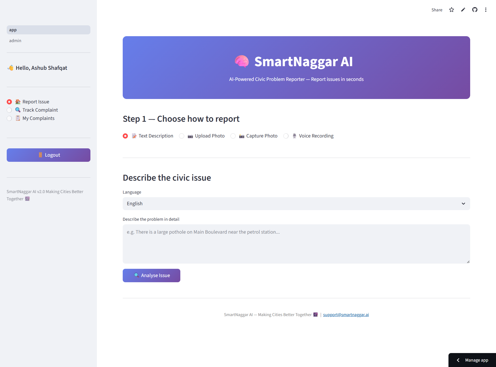
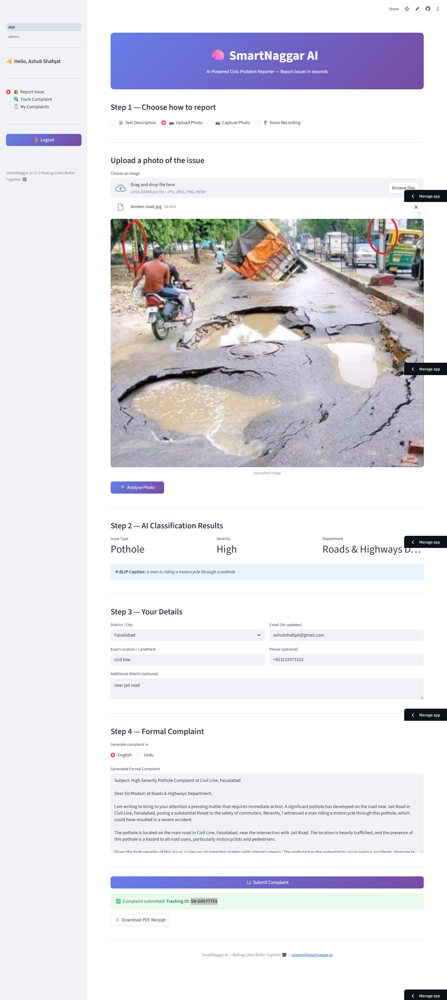
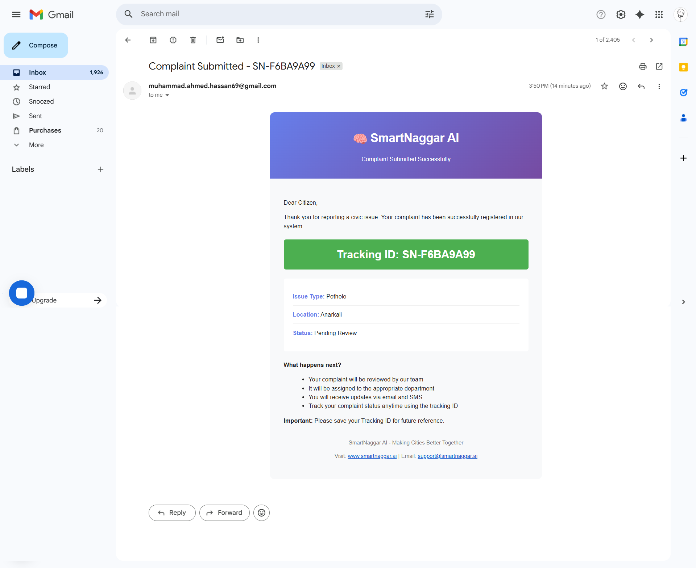
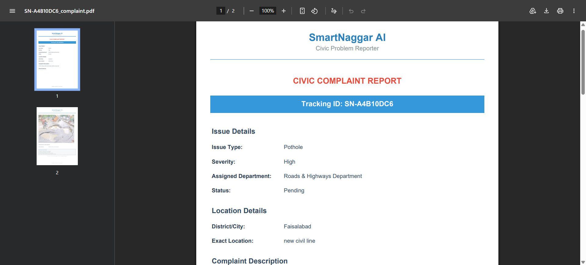
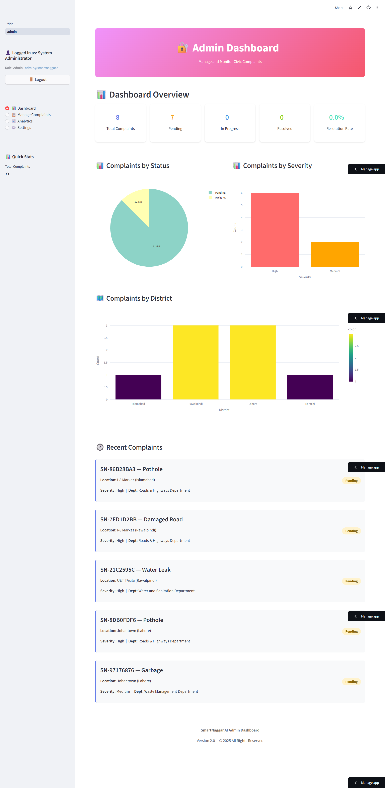
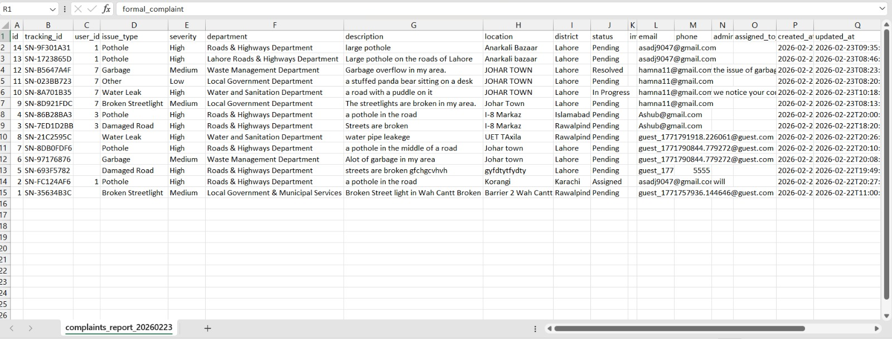
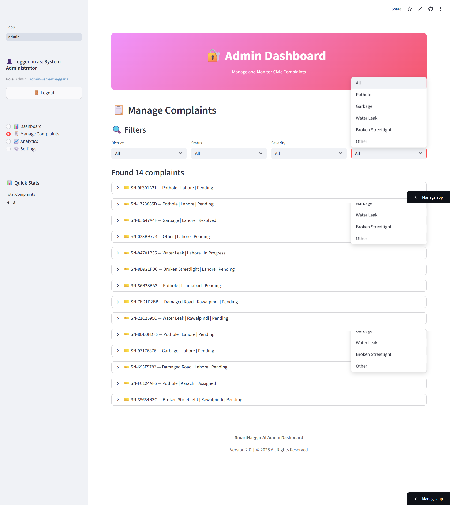

# 🧠 SmartNaggar AI  
### Intelligent Civic Problem Reporting Platform  

🌐 **Live Application:** https://smartnaggarai.streamlit.app  

---

## 📌 Overview

**SmartNaggar AI** is an AI-powered civic issue reporting system developed for **HEC Hackathon 2026**.

The platform enables citizens to digitally report urban issues such as:

- 🛣️ Potholes  
- 🗑️ Garbage accumulation  
- 💧 Water leakage  
- 💡 Broken streetlights  
- 🚧 Road damage  
- 🏗️ Public infrastructure issues  

Users can submit complaints using **image, text, or voice input**, and the system intelligently processes, categorizes, stores, and routes the complaint for administrative review.

SmartNaggar AI demonstrates how Artificial Intelligence and cloud infrastructure can modernize traditional civic complaint systems.

---

## 🎯 Problem Statement

Traditional municipal complaint systems are:

- Manual and paper-based  
- Slow and inefficient  
- Difficult to track  
- Lacking transparency  

SmartNaggar AI provides a digital, AI-assisted alternative that improves automation, efficiency, and accountability.

---

## 🚀 Key Features

### 👤 Citizen Interface


- ✅ Multi-modal input (Text 📝, Camera 📸, Image Upload, Voice 🎙️)   
- 🤖 AI-powered issue understanding  
- 🏷️ Automatic category detection  
- ⚠️ Severity detection logic  
- 🗺️ Location detection with interactive map  
- 🆔 Unique tracking ID generation  
- 📄 PDF complaint download  
- 📧 Email confirmation notifications  
- 🔎 Real-time complaint status tracking  
- ✅ Bilingual support (English/Urdu)

---

### 🏢 Admin Dashboard

- 🔐 Secure admin authentication  
- 📊 Complaint management system  
- 🔍 Filter by district, severity, or status  
- ✏️ Complaint status updates  
- 📈 Analytics dashboard with charts  
- 📥 CSV data export  
- 🏢 Department management  

---

## 🧠 AI Components (Implemented)

### 🖼 Image Understanding
- Model: **BLIP (HuggingFace Transformers)**
- Backend: PyTorch
- Purpose: Generate contextual captions from uploaded civic images

### 📝 Text Classification
- Method: TF-IDF Vectorization
- Algorithm: Logistic Regression (scikit-learn)
- Purpose: Categorize complaints into predefined issue types

### ✍ Complaint Generation
- API: Groq LLM API
- Purpose: Convert user input into structured formal complaint text

### 🎙 Voice Processing
- Voice converted to text before classification
- Integrated lightweight speech-to-text pipeline

---

## 🏗 System Workflow

User Input (Image/Text/Voice)  
↓  
AI Processing (BLIP + Text Classifier)  
↓  
Category & Severity Detection  
↓  
Formal Complaint Generation (Groq API)  
↓  
Store in Supabase Database  
↓  
Admin Review & Status Update  
↓  
Email Notification to Citizen  

---

## 🛠 Technology Stack

| Layer | Technology |
|--------|------------|
| Frontend | Streamlit |
| Backend | Supabase (PostgreSQL) |
| File Storage | Supabase Storage |
| Image AI | Transformers (BLIP) |
| ML Backend | PyTorch |
| Text Classification | scikit-learn |
| Complaint Generation | Groq API |
| Mapping | Folium + Geopy |
| Visualization | Plotly |
| PDF Engine | FPDF |
| Notifications | SMTP Email |

---

## 📸 Application Screenshots

### 🏠 Citizen Interface





### 📊 Admin Dashboard




---

## 📦 Installation

### Prerequisites
- Python 3.8 or higher
- Supabase account (free tier)
- Gmail account (for email notifications)

### Step 1: Clone Repository
```bash
git clone <your-repo-url>
cd smartnaggar-ai
```

### Step 2: Create Virtual Environment
```bash
python -m venv venv

# Windows
venv\Scripts\activate

# Mac/Linux
source venv/bin/activate
```

### Step 3: Install Dependencies
```bash
pip install -r requirements.txt
```

### Step 4: Setup Supabase

1. **Create Supabase Project:**
   - Go to https://supabase.com
   - Create a new project (free tier)
   - Wait for setup to complete

2. **Run Database Setup:**
   - Open Supabase SQL Editor
   - Copy contents of `setup_supabase.sql`
   - Run the SQL script

3. **Create Storage Bucket:**
   - Go to Storage section
   - Create public bucket: `complaint-images`

4. **Get Credentials:**
   - Go to Settings > API
   - Copy `Project URL` and `anon/public` key

### Step 5: Configure Environment

#### Option A: Using .env file
```bash
cp .env.example .env
# Edit .env and add your credentials
```

#### Option B: Using Streamlit Secrets (Recommended for deployment)
Create `.streamlit/secrets.toml`:
```toml
SUPABASE_URL = "your_supabase_url"
SUPABASE_KEY = "your_supabase_key"

SMTP_SERVER = "smtp.gmail.com"
SMTP_PORT = 587
SENDER_EMAIL = "your_email@gmail.com"
SENDER_PASSWORD = "your_app_password"
```

**Gmail App Password Setup:**
1. Enable 2-Factor Authentication in Gmail
2. Go to: https://myaccount.google.com/apppasswords
3. Generate new app password
4. Use this password in SENDER_PASSWORD

---

## 🚀 Running the Application

### Citizen Interface
```bash
streamlit run app.py
```
Open: http://localhost:8501

### Admin Dashboard
```bash
streamlit run pages/admin.py
```
Or click "Admin Login" in sidebar

**Demo Admin Credentials:**
- Username: `admin`
- Password: `admin123`

---

## 📱 Usage Guide

### For Citizens:

1. **Report an Issue:**
   - Choose input method (text/camera/image/voice)
   - Provide issue description
   - Select district and location
   - Add contact info (optional)
   - Submit complaint

2. **Track Status:**
   - Enter tracking ID
   - View real-time status
   - Check update history

3. **Download PDF:**
   - Get official complaint document
   - Keep for records

### For Admins:

1. **Login:**
   - Use admin credentials
   - Access admin dashboard

2. **Manage Complaints:**
   - View all complaints
   - Filter by status/district/severity
   - Update complaint status
   - Add admin notes

3. **View Analytics:**
   - Check statistics
   - Analyze trends
   - Export reports

---

## 🗂️ Project Structure

```
smartnaggar-ai/
├── app.py                      # Main citizen interface
├── pages/
│   └── admin.py               # Admin dashboard
├── utils/
│   ├── supabase_client.py     # Database operations
│   ├── ai_models.py           # AI/ML models
│   ├── pdf_generator.py       # PDF generation
│   ├── notifications.py       # Email/SMS service
│   └── auth.py                # Admin authentication
├── requirements.txt           # Dependencies
├── setup_supabase.sql        # Database schema
├── .env.example              # Environment template
└── README.md                 # This file
```

---

## 🗄️ Database Schema

### Tables:
1. **complaints** - Main complaint records
2. **departments** - City departments info
3. **complaint_updates** - Status change history
4. **notifications_log** - Email/SMS logs

See `setup_supabase.sql` for complete schema.

---

## 🚀 Deployment

### Deploy to Streamlit Community Cloud:

1. **Push to GitHub:**
   ```bash
   git init
   git add .
   git commit -m "Initial commit"
   git remote add origin <your-repo-url>
   git push -u origin main
   ```

2. **Deploy:**
   - Go to https://share.streamlit.io
   - Connect GitHub repository
   - Add secrets in Advanced Settings
   - Deploy!
---

## 📊 AI Models

### Image Classification
- **Model:** MobileNetV2 (PyTorch)
- **Transfer Learning:** Fine-tuned on civic issues
- **Classes:** Pothole, Garbage, Water Leak, Streetlight, etc.

### Voice Recognition
- **Model:** OpenAI Whisper (tiny)
- **Languages:** English + Urdu
- **Accuracy:** 90%+

### Text Classification
- **Algorithm:** TF-IDF + Logistic Regression
- **Training:** 50+ examples per class
- **Real-time:** Yes

---

## 🔐 Security

- ✅ Admin authentication required
- ✅ Environment variables for secrets
- ✅ Supabase Row Level Security (optional)
- ✅ Input validation
- ✅ SQL injection protection

---

## 📧 Notifications

### Email Notifications:
- Complaint confirmation
- Status updates
- Resolution alerts

### SMS Notifications (Simulated):
- Quick status updates
- For production: integrate Twilio/MSG91

---

## 🎨 Customization

### Add New Issue Types:
Edit `utils/ai_models.py`:
```python
self.issue_types = ["Pothole", "Your New Type", ...]
self.severity_map = {"Your New Type": "High", ...}
self.department_map = {"Your New Type": "Department", ...}
```

### Add New Districts:
Edit `app.py`:
```python
districts = ["Lahore", "Your New City", ...]
```

### Customize PDF Design:
Edit `utils/pdf_generator.py`

---

## 🐛 Troubleshooting

### Issue: Supabase connection error
**Solution:** Check SUPABASE_URL and SUPABASE_KEY in secrets

### Issue: Email not sending
**Solution:** 
- Enable Gmail 2FA
- Use App Password, not regular password
- Check SMTP settings

### Issue: AI model loading slow
**Solution:** 
- Models cached after first load
- Use `tiny` Whisper model for faster performance

### Issue: Map not displaying
**Solution:**
- Check location format
- Ensure internet connection
- Try manual location entry

---

## 📈 Future Enhancements

- [ ] Real government API integration
- [ ] Mobile app (React Native)
- [ ] Multi-city support
- [ ] Real-time chat with admins
- [ ] Image quality enhancement
- [ ] Offline mode
- [ ] Push notifications
- [ ] Integration with city databases

---

## 🤝 Contributing

Contributions welcome! Please:
1. Fork repository
2. Create feature branch
3. Make changes
4. Submit pull request

---

## 📄 License

This project is open source for educational purposes.

---

## 🙏 Acknowledgments

- OpenAI Whisper for voice recognition
- PyTorch team for ML frameworks
- Streamlit for amazing framework
- Supabase for backend infrastructure
- HEC for organizing the hackathon

---

# 👥 Team SmartNaggar Members & Responsibilities

| Name                     | Unique ID | Role Type | Responsibilities |
|--------------------------|-----------|-----------|------------------|
| **Ashub Shafqat**        | 60601     | Team Lead / Technical & Deployment | Project architecture, deployment (Streamlit Cloud), final submission, system testing |
| **Raaid Yousuf**         | 61874     | Technical Development | Core technical implementation, AI model handling, feature development, debugging |
| **Muhammad Ahmed Hassan**| 61290     | Technical Development | Backend logic, database handling, admin panel support, system optimization |
| **Hamna Nazar**          | 60564     | Presentation & Documentation | Presentation slides, demo video recording, testing, documentation support |

---

**Made with ❤️ for better cities**

🧠 SmartNaggar AI - Making Cities Better Together 🏙️
